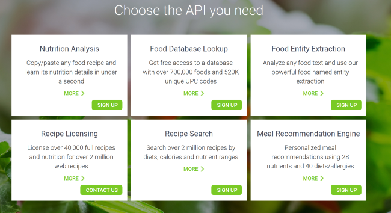
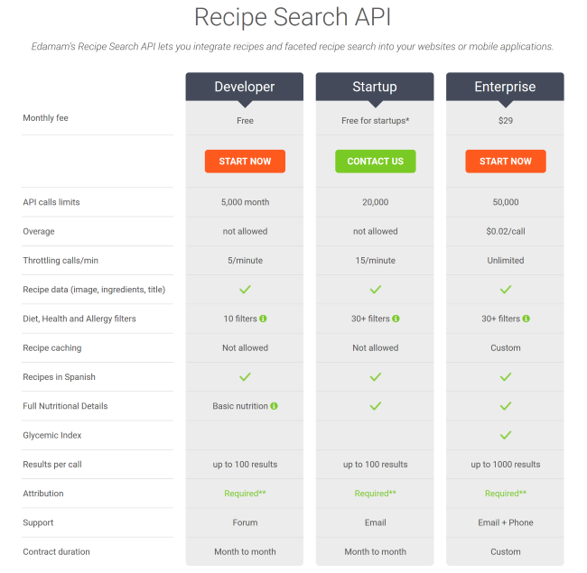

# Edamam Wrapper Library

Welcome to the [Edamam](https://www.edamam.com/) library! This library provides a simple interface to Edamam's various API services. Currently the library provides support for the [Recipe Search](https://developer.edamam.com/edamam-recipe-api) API and the [Food Database Lookup](https://developer.edamam.com/food-database-api) API. 

## Requirements

Before using the wrapper, you'll need to create an account at the Edaman site.

Once you've registered, you'll need to create an application. Make note of your `Application ID` and `Application Key` values as you'll need this in your usage of the wrapper. 

There are three different [API levels](https://developer.edamam.com/edamam-recipe-api) you can choose from with the `Developer` level being free and useful for testing. 

## Installation

Download (or clone) the bits and run `npm install` to load the dependencies.

## Recipe Search API

The [Recipe Search](https://developer.edamam.com/edamam-recipe-api) functionality allows for searches via plain text, ingredients, and even caloric count. Here's a simple example of using the search functionality.

	const edamam = require('./edamam');

	let search = {
		query:'rice',
		app_id:'your app id',
		app_key:'your app key',
		max_calories:500
	}

	edamam.recipeSearch(search)
	.then(res => {
		console.log(res);
	})
	.catch(e => {
		console.error('Error: '+e);	
	});

In this example, we load in the wrapper library and then do a search for recipes that include rice. A `max_calories` argument is passed to return healthier recipes. 

The result of the `recipeSearch` call is an object with the following properties:

* `count`: The total number of results.
* `results`: An array of recipe results. See the [API docs](https://developer.edamam.com/edamam-docs-recipe-api) for what is included in each recipe result.
* `from`: Zero-based index representing where your results begin.
* `to`: Represents the requested upper range of your results (and where you could begin your next search if implementing paging). 
* `more`: A boolean representing if more results are available.

The `recipeSearch` method accepts one argument, a simple JavaScript object with the following keys:

* `app_id`: Your application ID value. **Required** 
* `app_key`: Your application key value. **Required**
* `query`: Text value to use in the search. **Required**
* `start`: Zero-based index from which to begin returning results. *Defaults to 0*. 
* `to`: The index from which to begin *not* returning results. So given you want the first ten results, you would use a `start` value of 0 and an `end` value of 10.
* `max`: The max number of recipes to return. This cannot be used with `to`. 
* `max_ingredients`: The maximum number of ingredients used in the recipe.
* `diet` and `health`: These are labels that describe the dietary and health related properties of the recipe. See the [API docs](https://developer.edamam.com/edamam-docs-recipe-api) for details on the acceptable values.
* `min_calories` and `max_calories`: Values representing the minimum and maximum desired calories.
* `min_time` and `max_time`: Values representing the minimum and maximum desired cooking time in minutes.
* `excluded`: An array of ingredients that should not be present in the results. 
